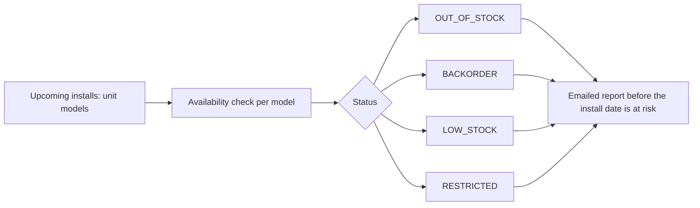

# Backorder Buster

Backorder Buster, a small automation for my day job that attacks the most expensive surprise in a sales pipeline: a unit that is sold, scheduled and then turns out to be backordered. It signs in to the distributor portal with a captured session, checks the availability of every model on the upcoming installs, classifies each one as in stock, low stock, backordered or restricted, and emails a short report before the install date is at risk, so a model can be swapped or a customer warned while there is still time. Built because I was the person who had to make that phone call.

## How it fits together

## Verification and evidence

- Small automation for the day job: a swap or a customer warning happens days early instead of the morning of.

_Design notes only._

Part of the projects on [https://rajranpariya.com](https://rajranpariya.com/#artifact-backorder). Built by directing AI, verified against the running system; the product code stays private, the design and the tests are here.
