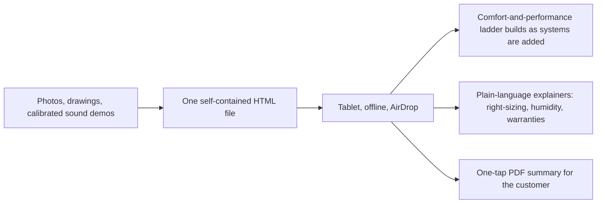

# Comparison and presentation tool for the sales conversation

A presentation tool for comparing heating and cooling systems on the three things a customer actually feels: comfort, efficiency and sound. One self-contained HTML file for a tablet, with embedded photos, drawings and unit sound demos calibrated so the differences you hear are proportionally real, a comfort-and-performance ladder that builds as you add systems, plain-language explainers on right-sizing, humidity and warranties, and a one-tap PDF summary the customer can take away. Built by a salesperson for the sales conversation; it works offline and travels by AirDrop.

## How it fits together

## Verification and evidence

- Built by a salesperson for the sales conversation; the branded file itself stays private.

_Design notes only; the file carries manufacturer material and is not published._

Part of the projects on [https://rajranpariya.com](https://rajranpariya.com/#artifact-sales-tool). Built by directing AI, verified against the running system; the product code stays private, the design and the tests are here.
