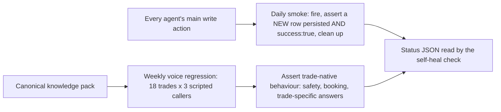

# Verification and evals

Verification I trust more than reports. A green test suite that shares a predicate with the code cannot falsify it, so I delete each gate in turn and watch which tests still pass; on the email guard that found four sub-checks that could be removed with zero failures, and they now assert behaviour. A daily smoke check fires each agent's main write and asserts a real row landed, not a success flag. A weekly voice harness replays scripted callers across 18 trades with an independent judge, recalibrated once after it scored a safety-first emergency redirect as a failure. Done means an external effect a separate checker verified.

## How it fits together

## Verification and evidence

- A green test suite that shares a predicate with the code cannot falsify it, so gates are deleted one at a time to see which tests still pass.
- Deterministic, auditable rules are chosen over a model call wherever the input is structured.

_fleet_smoke_test.py and voice_regression_harness.py are the real harnesses with product-specific names generalized._

Part of the projects on [https://rajranpariya.com](https://rajranpariya.com/#artifact-evals). Built by directing AI, verified against the running system; the product code stays private, the design and the tests are here.
