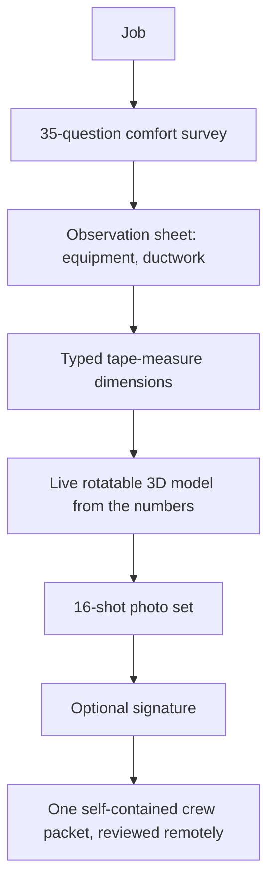

# Field app with a 3D crew packet

A single-purpose iPad app for the sales appointment, built for my own day job. It replaces the paper comfort-survey booklet with a seven-step flow: the job, a 35-question comfort survey, an observation sheet for the existing equipment and ductwork, typed tape-measure dimensions, a live rotatable 3D model built from those numbers, a 16-shot photo set and an optional signature. It exports one self-contained crew packet the install team can review remotely, which removes the separate pre-install walkthrough. It runs fully offline with no backend, and it has two honesty rules I refuse to improve away: photos never generate the 3D, and a blank field stays visibly blank rather than being guessed.

## How it fits together

## Verification and evidence

- Two honesty rules: photos never generate the 3D, and a blank field stays visibly blank rather than being guessed.
- Runs fully offline with no backend.

_Design notes only; the app belongs to the day job._

Part of the projects on [https://rajranpariya.com](https://rajranpariya.com/#artifact-field-app). Built by directing AI, verified against the running system; the product code stays private, the design and the tests are here.
