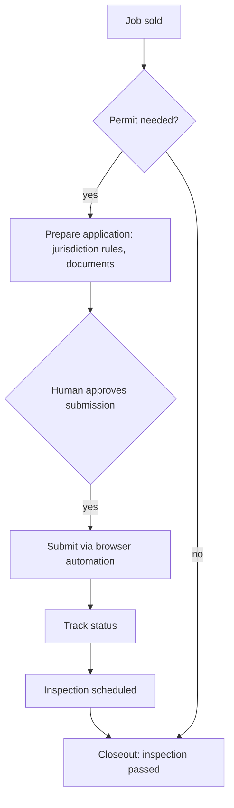

# Permit and inspection lifecycle

Permit-and-inspection lifecycle agent. One webhook entry point routes six actions behind authentication and role checks; permit status is an explicit state machine that spans inspection scheduling and results, unknown actions return 400, and a locked design rule says nothing is ever auto-submitted. A headless-browser sidecar, memory-capped and loopback-only, with form filling, CAPTCHA detection and a WebSocket hand-off to a human, is built and health-checked, but no workflow calls it yet and only test screenshots exist. What runs today is record creation plus a deterministic permit-required decision, exercised by a daily automated check.

## How it fits together

## Verification and evidence

- Nothing is filed without a human approval; the agent prepares, tracks and reminds.

_Design notes only._

Part of the projects on [https://rajranpariya.com](https://rajranpariya.com/#artifact-permit-lifecycle). Built by directing AI, verified against the running system; the product code stays private, the design and the tests are here.
