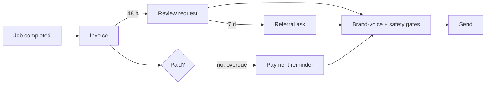

# Post-job follow-up: accounting, reviews, referrals

Post-job follow-up agents, the pair I am most pleased with because the timing is the product. An accounting agent creates invoices, reports collections, and exposes four payment-exception types through a manager-only action. A review-and-referral agent is triggered by an invoice-paid-in-full event or a daily scan of completed work; a per-trade playbook supplies the ask timing, and suppression rules cap requests at two attempts with a 48-hour minimum gap, logging the reason for every suppression. Every complaint type is flagged for a human; none auto-resolves. A composite sequence is designed to wait 48 hours before the review ask and seven days before the referral touch; that sequence has not yet run.

## How it fits together

## Verification and evidence

- The 48-hour / 7-day chain is designed as one composable sequence so a single completed job triggers the whole tail.

_Design notes only._

Part of the projects on [https://rajranpariya.com](https://rajranpariya.com/#artifact-post-job-followup). Built by directing AI, verified against the running system; the product code stays private, the design and the tests are here.
