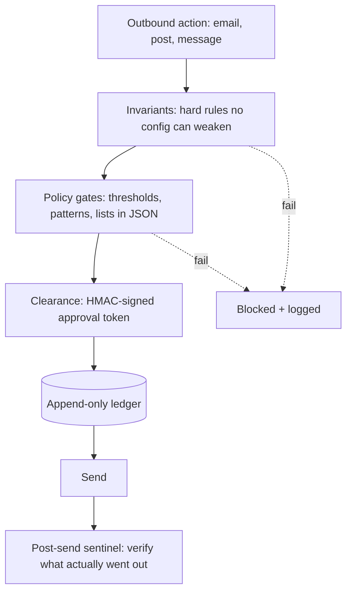

# Safety layers for unattended operation

Two safety layers for unattended operation. A content pipeline where a scheduled writer drafts and self-scores short posts, then submits them to a deterministic code gate (blocklist, banned claims, a stat whitelist with inline sourcing, no personal attribution, a quality floor) before anything publishes; a one-call kill switch returns it to human approval. Beneath it, a separate outbound guard for email: two hardcoded invariants no configuration can weaken (one forbids contact with a restricted party), HMAC clearances the transport demands, an append-only ledger, and a post-send sentinel. 119 tests; two independent adversarial review rounds found 25 issues before deployment.

## How it fits together

## Verification and evidence

- Covered by 119 tests; two independent adversarial review rounds surfaced 25 findings, including 5 blockers, before release.
- tests/ holds the sanitized test suite: the behaviour is the proof, the product code stays private.

_tests/test_safety_layer.py is an EXCERPT of the real suite: 29 of 119 tests, the classes that prove the mechanism; the rest test private policy lists._

Part of the projects on [https://rajranpariya.com](https://rajranpariya.com/#artifact-safety-layer). Built by directing AI, verified against the running system; the product code stays private, the design and the tests are here.
