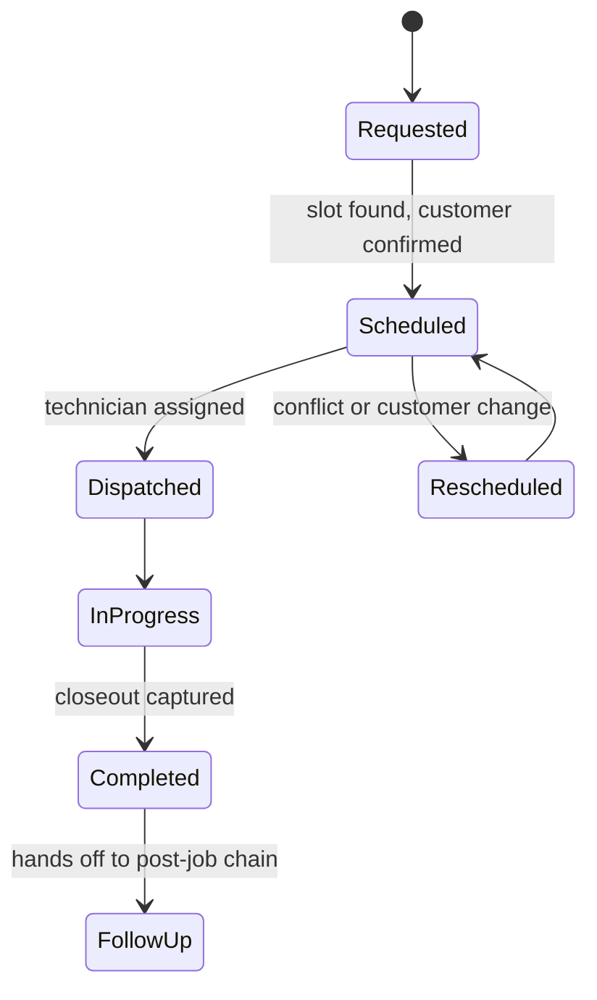

# Scheduling and work orders

Scheduling and work-order agents. One workflow-engine agent books, reschedules and cancels appointments against existing bookings; the other turns a won job into a work order that a manager must review before the scheduling and billing handoffs fire. Every request passes authentication, a role check and per-tenant task toggles; installation, inspection, callback and emergency bookings are held for human approval. The voice channel offers slots filtered against existing appointments and has a review-first mode for busy periods. A daily automated check exercises 14 agents' write paths and asserts a row persisted; the last seven runs passed 14 of 14. Dispatch recommendations remain stubs.

## How it fits together

## Verification and evidence

- Every state change writes a row and an audit entry; a work order can always be reconstructed from its history.

_Design notes only._

Part of the projects on [https://rajranpariya.com](https://rajranpariya.com/#artifact-scheduling-workorders). Built by directing AI, verified against the running system; the product code stays private, the design and the tests are here.
