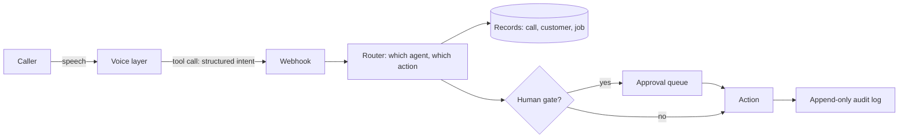

# Voice to structured action

Voice-to-structured-action layer for a field-service operations system. A seven-assistant squad: one call-taker greets, withholds the caller's name until confirmed, triages urgency from a per-trade knowledge pack, and hands off to six specialists. The voice platform's 30-second budget per tool call forced a split: anything on the conversational path runs in-process against the database; slower work falls to a workflow engine behind a 25-second abort. Caller identity comes from telephony metadata and overwrites whatever the model supplies; a booking exists only when a row is written. A weekly text-simulation harness runs three scripted scenarios across 18 trades; the latest run passed 18 of 18.

## How it fits together

## Verification and evidence

- Designed around a 30-second rule: what a live caller can wait for is the whole spec for what runs during the call; everything slower is queued.
- Verified on the running system with a daily automated smoke check across 14 agents (14/14 passing) and a weekly 18-trade voice regression suite (see ../evals).

_No product code here by design; the harnesses that verify this path are in ../evals._

Part of the projects on [https://rajranpariya.com](https://rajranpariya.com/#artifact-voice-to-action). Built by directing AI, verified against the running system; the product code stays private, the design and the tests are here.
